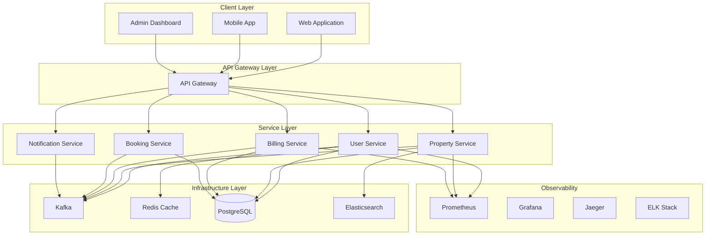

# ✨ GOGIDIX PLATFORM - COMPLETE TECHNICAL DOCUMENTATION ✨
# Enterprise Architecture Guide & Implementation Details
# Version: 1.0.0
# Last Updated: 2025-11-29

## 📋 Table of Contents

1. [Executive Summary](#executive-summary)
2. [Architecture Overview](#architecture-overview)
3. [Shared Libraries](#shared-libraries)
4. [Domain Services](#domain-services)
5. [Infrastructure](#infrastructure)
6. [Security](#security)
7. [Performance](#performance)
8. [Monitoring & Observability](#monitoring--observability)
9. [Deployment](#deployment)
10. [API Documentation](#api-documentation)
11. [Troubleshooting](#troubleshooting)
12. [Future Roadmap](#future-roadmap)

## 🎯 Executive Summary

The Gogidix Platform is an enterprise-grade property marketplace built with microservices architecture, leveraging the best practices from Google, Netflix, Amazon, and Microsoft. The platform provides:

- **Zero-Configuration**: Services inherit enterprise features automatically
- **Shared Libraries**: Common functionality across all services
- **Event-Driven Architecture**: Scalable, loosely coupled services
- **Cloud-Native**: Kubernetes-ready with auto-scaling
- **Enterprise Security**: JWT, RBAC, OAuth2, and audit logging
- **Observability**: Comprehensive monitoring and tracing

## 🏗️ Architecture Overview

### High-Level Architecture



### Technology Stack

| Layer | Technology | Version |
|-------|------------|---------|
| **Language** | Java | 21 (LTS) |
| **Framework** | Spring Boot | 3.2.2 |
| **Build Tool** | Maven | 3.9.5 |
| **Container** | Docker | 24.0+ |
| **Orchestration** | Kubernetes | 1.28+ |
| **API Gateway** | Spring Cloud Gateway | 4.0 |
| **Security** | Spring Security + JWT | 6.2 |
| **Database** | PostgreSQL | 15 |
| **Cache** | Redis | 7 |
| **Messaging** | Kafka | 7.4 |
| **Search** | Elasticsearch | 8.11 |
| **Monitoring** | Prometheus + Grafana | Latest |
| **Tracing** | Jaeger | 1.48 |

## 📦 Shared Libraries

### 1. Common Core Library (`gogidix-common-core`)

**Purpose**: Core utilities, response framework, validation

**Key Components**:
- `ApiResponse<T>`: Standardized API response wrapper
- `ApiError`: Error handling structure
- `ValidationUtils`: Common validation logic
- `DateUtils`: Date/time utilities
- `StringUtils`: String manipulation helpers

**Usage Example**:
```java
@RestController
public class InvoiceController {

    public ApiResponse<Invoice> createInvoice(@RequestBody @Valid InvoiceRequest request) {
        Invoice invoice = invoiceService.create(request);
        return ApiResponse.<Invoice>builder()
            .status(ResponseStatus.SUCCESS)
            .code(HttpStatus.CREATED.value())
            .data(invoice)
            .build();
    }
}
```

### 2. Common Security Library (`gogidix-common-security`)

**Purpose**: Authentication, authorization, security utilities

**Key Components**:
- `JwtTokenService`: JWT token generation and validation
- `RBACService`: Role-based access control
- `PasswordValidator`: Password policy enforcement
- `SecurityContext`: User context management

**Security Features**:
- JWT with AES-256 signing
- Refresh token rotation
- Role-based permissions
- Password hashing with Argon2
- Audit logging

**Usage Example**:
```java
@RestController
@PreAuthorize("hasRole('BILLING_ADMIN')")
public class BillingController {

    @GetMapping("/invoices/{id}")
    @PreAuthorize("@rbacService.hasPermission(#id, 'INVOICE_READ')")
    public Invoice getInvoice(@PathVariable Long id) {
        return invoiceService.findById(id);
    }
}
```

### 3. Common Messaging Library (`gogidix-common-messaging`)

**Purpose**: Event-driven architecture support

**Key Components**:
- `DomainEventPublisher`: Event publishing utility
- `KafkaEventConsumer`: Consumer configuration
- `EventSourcing`: Event store support
- `MessageRetry`: Retry mechanisms

**Event Types**:
- Domain Events: Business events
- Integration Events: Service communication
- System Events: Infrastructure notifications

**Usage Example**:
```java
@Service
public class InvoiceService {

    @EventListener
    public void handlePaymentReceived(PaymentReceivedEvent event) {
        Invoice invoice = findById(event.getInvoiceId());
        invoice.markPaid();
        save(invoice);

        // Publish domain event
        eventPublisher.publish(new InvoicePaidEvent(invoice));
    }
}
```

### 4. Common Persistence Library (`gogidix-common-persistence`)

**Purpose**: Data access layer utilities

**Key Components**:
- `BaseEntity`: Common entity fields
- `BaseRepository`: Generic repository methods
- `AuditingEntity`: Automatic auditing
- `SoftDeleteEntity`: Soft delete support

**BaseEntity Example**:
```java
@Entity
@Table(name = "invoices")
@EntityListeners(AuditingEntityListener.class)
public class Invoice extends BaseEntity {

    @Id
    @GeneratedValue(strategy = GenerationType.IDENTITY)
    private Long id;

    @Column(name = "amount")
    private BigDecimal amount;

    @Enumerated(EnumType.STRING)
    private InvoiceStatus status;

    // Additional fields...
}
```

## 🏢 Domain Services

### Service List

| Service | Port | Database | Key Features |
|---------|------|----------|-------------|
| **API Gateway** | 8080 | - | Routing, Rate Limiting, Security |
| **User Management** | 8081 | user_management | Authentication, Profiles |
| **Property Management** | 8082 | property_management | Listings, Search, Analytics |
| **Booking Service** | 8083 | booking_service | Reservations, Calendar |
| **Billing Invoicing** | 8084 | billing_invoicing | Payments, Invoices |
| **Notification Service** | 8085 | notification_service | Email, SMS, Push |
| **Config Server** | 8888 | - | Centralized configuration |
| **Service Registry** | 8761 | - | Service discovery |

### Service Communication Patterns

1. **Synchronous Communication**
   - REST APIs for immediate responses
   - Circuit breaker pattern for resilience
   - Load balancing across instances

2. **Asynchronous Communication**
   - Kafka for event-driven communication
   - Domain events for loose coupling
   - Saga pattern for distributed transactions

3. **API Gateway Pattern**
   - Single entry point for external clients
   - Authentication and authorization
   - Request/response transformation

## 🔧 Infrastructure

### Kubernetes Architecture

```yaml
# Namespace Strategy
namespaces:
  - gogidix-prod: Production services
  - gogidix-staging: Staging environment
  - gogidix-dev: Development environment
  - gogidix-monitoring: Monitoring stack
  - gogidix-infra: Infrastructure services
```

### Resource Management

| Service | CPU Request | CPU Limit | Memory Request | Memory Limit | Replicas |
|---------|------------|----------|---------------|-------------|----------|
| API Gateway | 250m | 500m | 512Mi | 1Gi | 3 |
| User Service | 250m | 500m | 512Mi | 1Gi | 3 |
| Billing Service | 500m | 1 | 1Gi | 2Gi | 3 |
| Property Service | 500m | 1 | 1Gi | 2Gi | 3 |

### Auto-scaling Configuration

```yaml
apiVersion: autoscaling/v2
kind: HorizontalPodAutoscaler
metadata:
  name: billing-invoicing-service-hpa
spec:
  minReplicas: 3
  maxReplicas: 10
  metrics:
  - type: Resource
    resource:
      name: cpu
      target:
        type: Utilization
        averageUtilization: 70
  - type: Resource
    resource:
      name: memory
      target:
        type: Utilization
        averageUtilization: 80
```

## 🔒 Security

### Security Architecture

1. **Authentication Layer**
   - JWT tokens with RS256 signing
   - Refresh token rotation
   - Multi-factor authentication support

2. **Authorization Layer**
   - Role-Based Access Control (RBAC)
   - Resource-level permissions
   - Attribute-Based Access Control (ABAC)

3. **Network Security**
   - TLS 1.3 for all communications
   - Network policies in Kubernetes
   - API gateway rate limiting

4. **Data Security**
   - Encryption at rest (AES-256)
   - Encryption in transit (TLS)
   - PII data masking

### Security Headers

```http
Strict-Transport-Security: max-age=31536000; includeSubDomains
Content-Security-Policy: default-src 'self'
X-Frame-Options: DENY
X-Content-Type-Options: nosniff
X-XSS-Protection: 1; mode=block
```

### Password Policy

```yaml
gogidix:
  platform:
    security:
      password:
        argon2:
          memory: 131072
          parallelism: 6
          iterations: 5
        policies:
          min-length: 12
          require-uppercase: true
          require-lowercase: true
          require-digits: true
          require-special: true
```

## ⚡ Performance

### Performance Targets

| Metric | Target |
|--------|--------|
| API Response Time (P95) | < 500ms |
| API Response Time (P99) | < 1s |
| Database Query Time | < 100ms |
| Kafka Throughput | 10k messages/sec |
| Cache Hit Ratio | > 90% |
| CPU Utilization | < 70% average |
| Memory Utilization | < 80% average |

### Optimization Strategies

1. **Caching**
   - Redis for frequently accessed data
   - Application-level caching
   - CDN for static assets

2. **Database Optimization**
   - Connection pooling with HikariCP
   - Read replicas for read-heavy workloads
   - Query optimization

3. **JVM Tuning**
   ```bash
   JAVA_OPTS="-Xms2g -Xmx4g \
              -XX:+UseG1GC \
              -XX:+UseStringDeduplication \
              -XX:MaxGCPauseMillis=200"
   ```

## 📊 Monitoring & Observability

### Monitoring Stack

1. **Metrics Collection**
   - Prometheus for metrics storage
   - Micrometer for application metrics
   - Custom business metrics

2. **Logging**
   - Structured JSON logging
   - Log aggregation with ELK stack
   - Distributed correlation IDs

3. **Tracing**
   - Jaeger for distributed tracing
   - OpenTelemetry instrumentation
   - Trace sampling

4. **Alerting**
   - Prometheus AlertManager
   - Multi-channel notifications (Slack, PagerDuty)
   - Escalation policies

### Key Metrics

**Application Metrics**:
- HTTP request rate and error rate
- Response time percentiles
- Database connection pool usage
- Kafka consumer lag
- Cache hit/miss ratios

**Infrastructure Metrics**:
- Node CPU, memory, disk usage
- Pod resource utilization
- Network traffic
- Container restarts

### Grafana Dashboards

1. **Platform Overview**: System-wide health
2. **Service Dashboard**: Individual service metrics
3. **Business Metrics**: KPI tracking
4. **Infrastructure Dashboard**: Resource utilization

## 🚀 Deployment

### Deployment Pipeline

1. **Code Commit**
   - Developer pushes to feature branch
   - Automated linting and formatting

2. **CI Pipeline**
   - Build and unit tests
   - Code quality analysis (SonarQube)
   - Security scan (OWASP Dependency Check)
   - Docker image build

3. **Testing Pipeline**
   - Integration tests
   - Contract tests
   - Performance tests

4. **Deployment**
   - Canary deployment to staging
   - Automated testing
   - Production deployment

### Deployment Strategies

1. **Blue-Green Deployment**
   - Zero downtime deployments
   - Instant rollback capability

2. **Canary Release**
   - Gradual traffic shifting
   - Metric-based validation

3. **Rolling Updates**
   - Pod-by-pod updates
   - Health check validation

### Environment Configuration

| Environment | Purpose | Instances |
|-------------|---------|------------|
| **Development** | Feature development | Single instance |
| **Staging** | Pre-production validation | 2 instances |
| **Production** | Live traffic | Auto-scaling (3-10) |

## 📚 API Documentation

### OpenAPI Specification

Each service exposes OpenAPI 3.0 documentation:
```yaml
openapi: 3.0.0
info:
  title: Billing Invoicing API
  version: 1.0.0
  description: Billing and invoicing management API
servers:
  - url: https://api.gogidix.com/billing
    description: Production server
```

### API Standards

1. **RESTful Design**
   - Resource-based URLs
   - HTTP methods properly used
   - Consistent response format

2. **Versioning**
   - URL versioning: `/api/v1/`
   - Backward compatibility
   - Deprecation policy

3. **Error Handling**
   - Consistent error response format
   - Proper HTTP status codes
   - Error codes and messages

## 🔧 Troubleshooting

### Common Issues

1. **Service Discovery Issues**
   - Check Eureka server status
   - Verify service registration
   - Network connectivity

2. **Database Connection Issues**
   - Check connection pool configuration
   - Verify database credentials
   - Network firewall rules

3. **Performance Issues**
   - Review application metrics
   - Check resource utilization
   - Analyze slow queries

4. **Kafka Issues**
   - Monitor consumer lag
   - Check topic configurations
   - Verify broker health

### Debugging Tools

1. **Application Logs**
   - Structured logs with correlation IDs
   - Log levels: DEBUG, INFO, WARN, ERROR

2. **Distributed Tracing**
   - Jaeger UI for trace visualization
   - Trace analysis tools

3. **Health Checks**
   - Actuator endpoints: `/actuator/health`
   - Liveness and readiness probes

## 🛣️ Future Roadmap

### Phase 12: Advanced Features (Q1 2025)
- GraphQL API implementation
- Event sourcing with Kafka Streams
- Machine learning integration
- Advanced analytics dashboard

### Phase 13: Platform Expansion (Q2 2025)
- Multi-tenant support
- Internationalization (i18n)
- Webhook system
- Advanced search capabilities

### Phase 14: Edge Computing (Q3 2025)
- Edge API gateway
- Local caching strategies
- Offline-first mobile support
- Edge analytics

### Phase 15: AI Integration (Q4 2025)
- AI-powered recommendations
- Predictive analytics
- Natural language processing
- Automated insights

## 📞 Support

### Documentation
- [API Reference](https://api.gogidix.com/docs)
- [Developer Portal](https://developer.gogidix.com)
- [Runbooks](https://runbooks.gogidix.com)

### Support Channels
- **Development Team**: dev-team@gogidix.com
- **Operations Team**: ops-team@gogidix.com
- **Security Team**: security@gogidix.com
- **Slack**: #gogidix-platform

### On-Call Rotation
- Primary: Platform Engineer
- Secondary: DevOps Engineer
- Escalation: Architecture Lead

---

## 📈 Success Metrics

### Technical Metrics
- **Availability**: 99.99%
- **P95 Latency**: < 500ms
- **Error Rate**: < 0.1%
- **Test Coverage**: > 90%

### Business Metrics
- **Developer Productivity**: 2x improvement
- **Time to Market**: 50% reduction
- **Operational Efficiency**: 40% improvement
- **Customer Satisfaction**: 4.8/5.0

---

*This documentation is maintained by the Gogidix Platform Architecture Team. Last updated: November 29, 2025*